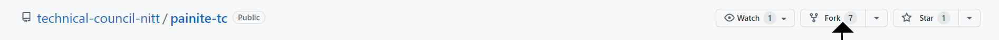
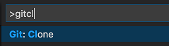

Welcome to PAINITE, an open source website created using [Docusaurus](https://docusaurus.io/).

Docusaurus is a static-site generator. It leverages the full power of React to make your site interactive. It provides out-of-the-box documentation features but can be used to create any kind of site (personal website, product, blog, marketing landing pages, etc).

### Install Git:

Git can be installed on the most common operating systems like Windows, Mac, and Linux. In fact, Git comes installed by default on most Mac and Linux machines!

[To know more about installation of Git on various systems visit the official Git website](https://github.com/git-guides/install-git)

### Install Node.js:

Node.js is an environment that can run JavaScript code outside of a web browser and is used to write and run server-side JavaScript apps.

> Docusaurus' minimum supported Node.js version is Node 8, but more recent versions will work as well.

Check that you have the minimum required version installed by running the following command:

`node -v`

### Fork the PAINITE Repository and clone it:

Visit the [PAINITE](https://github.com/technical-council-nitt/painite-tc) github page and fork it to your profile.



Clone your repository to your local machine:

import Tabs from "@theme/Tabs";
import TabItem from "@theme/TabItem";

<Tabs>
<TabItem value="From Command Palette">

1. Open the command palette with the key combination of Ctrl + Shift + P
2. At the command palette prompt, enter gitcl, select the Git: Clone command, and press Enter
3. When prompted for the Repository URL, select clone from GitHub, then press Enter.
4. If you are asked to sign into GitHub, complete the sign-in process.
5. Select (or create) the local directory into which you want to clone the project.
6. When you receive the notification asking if you want to open the cloned repository, select Open.

</TabItem>
<TabItem value="Using Integrated Terminal">

```
git clone git@github.com:USERNAME/docusaurus-tutorial.git # SSH #
or
git clone https://github.com/USERNAME/docusaurus-tutorial.git # HTTPS
```

</TabItem>
</Tabs>

`cd` into the repository which you just created.

### Install the Docusaurus init command

Docusaurus comes with a command line tool to help you scaffold a Docusaurus site with some example templates. To install the installer:

1. Run the following command in your VS Code Terminal.

`npm install --global docusaurus-init`

2.  Now run the `npm start` command to launch a browser window at [http://localhost:3000.](http://localhost:3000.)

Congratulations, you have just made your first Docusaurus site! Click around the pages to get a feel for it.

### Docusaurus

You can now contribute to the PAINITE website by working on:

1. The docs,blogs folder. These files are markdown files so it easy and fast to learn!

2. Or if you want to go further you can work the src files and improve your understanding of React!.

For a more detailed tutorial on docusaurus and its uses visit the [Docs](https://docusaurus.io/docs) website. It has a detailed explanation for everything related to docusaurus.
Or you can try the [5 min tutorial](https://tutorial.docusaurus.io/) for a breif understanding of docusaurus
